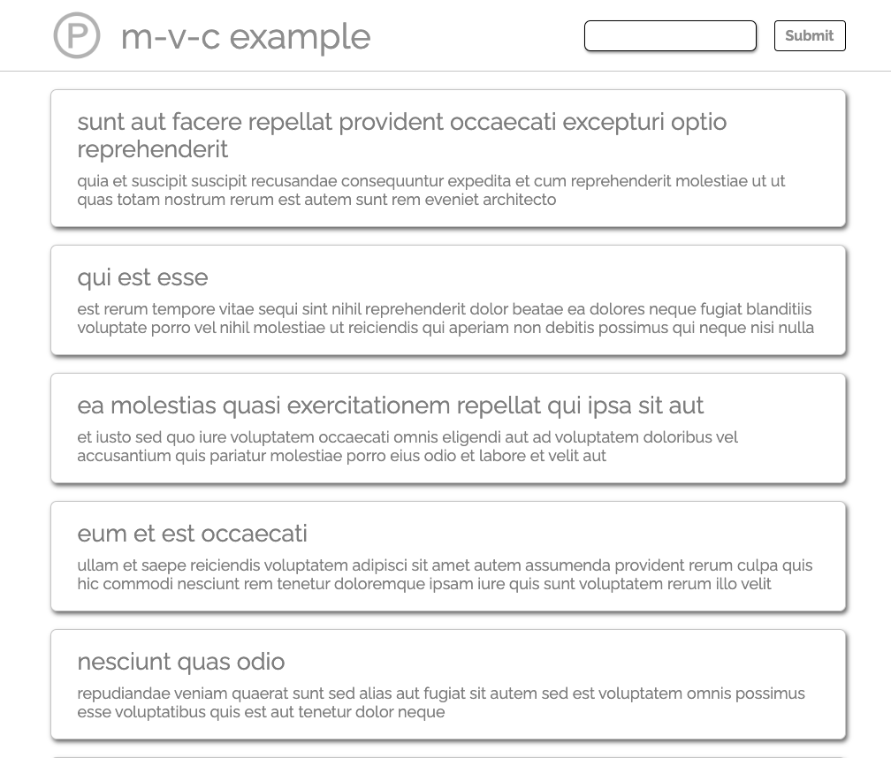

# Model View Controller (MVC) Architecture

## What is MVC?

MVC is a software architecture pattern for developing web applications. It is a way of structuring the codebase of an application into three distinct logical components: the Model, the View and the Controller. The MVC pattern is a way of separating the concerns of an application into three distinct parts, each with separate responsibilities.

## Why MVC?

The MVC pattern is a way of separating the concerns of an application into three distinct parts, each with separate responsibilities. This separation of concerns allows for the application to be more modular, and for the codebase to be more maintainable and scalable.

## This repository

This repository contains a simple example of a web application built using the MVC pattern. The application is a simple blog built to reinforce my own learning follwing the introduction of MVC in the Makers Academy course.

## How to use

1. Clone this repository
2. Install dependencies with `npm install`
3. Build the project with `npm run build`
4. Run `open index.html` to open the application in your browser

The text input box currently console logs the text entered into it when the submit button is clicked. It would be simple enough to add functionality to add new posts, or to display it on the page, but that was not the purpose of this project.

## Testing

This project uses Jest for testing. To run the tests, run `jest` in the terminal.

## Screenshot

